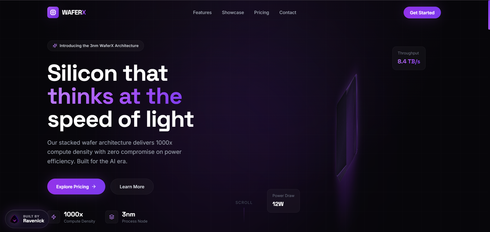
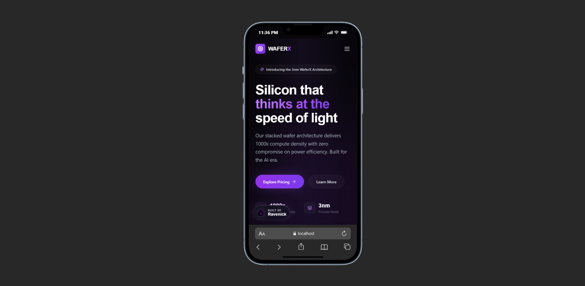

# WaferX Semiconductor Landing Page

A premium, OC-themed semiconductor landing page built around a layered wafer architecture concept. The interface demonstrates cinematic hero motion, dense product storytelling, responsive pricing systems, and Supabase-backed contact capture within a dark system-inspired aesthetic.

> [!NOTE]
> [Live demo](https://waferx-saas.vercel.app/)

## Preview





## Features

- Interactive 3D-style wafer stack with mouse-responsive motion and animated shimmer layers
- Dark OC interface styling with glow highlights, circuit textures, glass panels, and rapid transition vectors
- Responsive bento capability grid for communicating semiconductor performance details
- Animated ticker and slideshow sections for continuous product proof and visual rhythm
- Tiered pricing matrix with highlighted plan logic and conversion-focused CTAs
- Supabase-powered contact submission flow with loading, success, and error states
- Fixed Ravenick portfolio badge with logo lockup and sheen animation
- Portfolio-ready SEO metadata authored for Nelson Emmanuel | Ravenick

## Built With

| Tool           | Use                                                   |
| -------------- | ----------------------------------------------------- |
| React 18       | Component-driven landing page rendering               |
| TypeScript     | Typed app contracts and Supabase submission structures |
| Tailwind CSS 3 | Responsive layout, dark UI styling, and utility states |
| Lucide React   | Interface iconography and visual system markers        |
| Supabase       | Contact form persistence and backend data capture      |
| Vite           | Production compilation and development runtime         |

## Project Structure
```text
src/
  components/
    BentoGrid.tsx
    ContactForm.tsx
    Footer.tsx
    Hero.tsx
    Navbar.tsx
    Pricing.tsx
    RavenickBadge.tsx
    Slideshow.tsx
    Ticker.tsx
  lib/
    supabase.ts
  App.tsx
  index.css
  main.tsx
public/
  oc-logo-no-bg.png
supabase/
  migrations/
    20260919004037_create_contact_submissions.sql
```

## Run Locally
```bash
git clone https://github.com/Ravenick/waferx-saas.git
cd "waferx-saas"
npm install
npm run dev
```

For the contact form, add these variables to `.env.local` and to the Vercel project settings:

```env
VITE_SUPABASE_URL=your_supabase_project_url
VITE_SUPABASE_ANON_KEY=your_supabase_anon_key
```

The landing page still renders if these variables are missing, but contact submissions remain disabled until they are configured.

Create a production build with:
```bash
npm run build
```

## Author

Nelson Emmanuel | Raven
